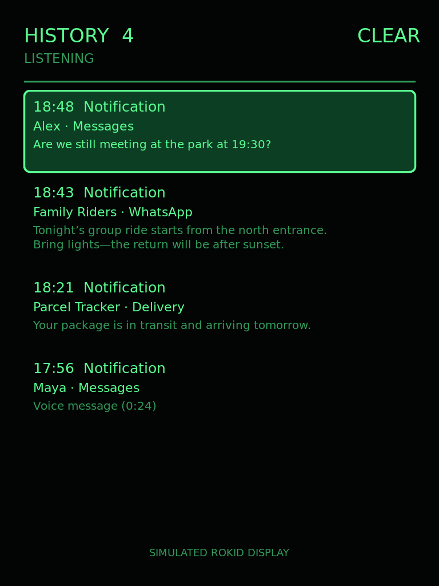

# Rokid Notification History

A small, open-source Android application for Rokid AI glasses that captures mirrored notification popups and keeps a local, scrollable history on the glasses.



> The image above is a simulated example. Names and messages are fictional.

## Features

- Portrait HUD interface designed for the Rokid glasses display
- Captures notification text exposed by Rokid's Accessibility UI
- Supports Rokid notification countdown settings from 5 to 30 seconds
- Deduplicates repeated countdown updates into one history entry
- Filters ordinary notifications from sideloaded apps and stale Sprite Launcher content
- Displays time, sender/group, and up to two lines of message text
- Scrollable history of up to 200 notifications
- Clear-history control
- English and Hebrew/RTL notification content
- Fully local storage with no network permission or data upload

## Privacy

Notification text is stored only in the application's private SQLite database on the glasses. The app has no Internet permission and does not transmit, analyze, or use captured information for any other purpose.

Accessibility access is required because consumer Rokid firmware does not expose mirrored iPhone notifications through Android's standard notification listener API. Android requires the user to enable this service manually.

## Installation

1. Build the APK or download it from the repository's Releases page.
2. Sideload it onto the Rokid glasses.
3. Launch **Notification History**.
4. Tap the instruction screen to open Accessibility settings.
5. Turn **Notification History Capture** on.
6. Swipe down until **ALLOW** is highlighted and select it.
7. Double-tap to go back and confirm that capture is on, then double-tap again to return to the app.

The instruction screen remains visible until the app detects that its Accessibility service is enabled.

## Controls

- Swipe up/down or use D-pad/volume controls to browse history.
- Swipe upward from the first notification to highlight **CLEAR**, then select it.
- **CLEAR** may also be tapped directly.

## Build

Requirements:

- Android SDK 35
- JDK 17 or newer
- Gradle 8.x

From the project root:

```bash
gradle assembleDebug
```

The debug APK is generated under `app/build/outputs/apk/debug/`.

No Rokid SDK binary is required: the optional Rokid system-service experiment uses Android Binder primitives directly. Notification capture on tested consumer firmware uses the Accessibility service.

## Technical overview

- `NotificationAccessibilityService` recognizes Rokid/Sprite notification popups and removes countdown updates.
- `NotificationCollectorService` provides standard Android notification-listener support where available.
- `HistoryStore` keeps up to 200 entries in a private SQLite database.
- `NotificationHistoryView` draws the compact glasses-oriented interface without external UI dependencies.

## Device compatibility

Developed and tested on Rokid AI glasses. Rokid firmware behavior may vary between consumer, enterprise, and future firmware versions.

## License

MIT License. See [LICENSE](LICENSE).
